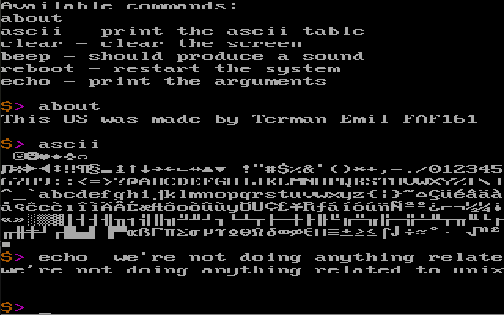

# Lab 3

## Topic: Command Line Interpreter

Create CLI application with the following functionalities:

1. CLI should have an INVITATION/PROMPT at the beginning of the line and it should be formed by 1 to 3 symbols. Prompter symbols should be in 2-3 different colors.

2. Cursor after prompter should be visible and could have any form (blinking or not; underscore or solid block)

3. User should be able to type some string from the keyboard and CLI must print on the screen all alphanumeric symbols, one by one. If cursor position will reach last column than printing should continue from the next line. Typed string should be collected into the memory using any method.

4. CLI should be able to detect if user will press special key “ENTER” and, if detected, CLI must print one empty line at the current line position and right after should be displayed entire collected string, which user was typing (the string should be printed even if it was longer than one or a few lines). After CLI should be ready to take new string.

5. Max. length of collected string should be 256 symbols. If the user will try to input string longer, than, CLI should stop at the 256th symbol and produce any single sound (BEEP) if the user will press any key from the keyboard, except ENTER or BACKSPACE keys.

6. CLI should be able to detect if the user will press BACKSPACE key and treat it accordingly. Deleted symbol (from the left side of the cursor) should disappear from the screen and it also should be deleted from the collected string. Cursor position should be updated. BACKSPACE treatment should also work in situations when it will be needed to move cursor to the previous line, in case of long strings.

7. If the user will press ENTER like a first key, than CLI should NOT print one empty line and just go to the next line with the prompter.

8. If the user will press BACKSPACE like a first key, than CLI should produce BEEP sound and no other action should be performed.

9. If the user will reach the last line of the screen CLI must continue to work and in case of moving to the next line by typing, or in case of pressing ENTER key, all the upper text from the screen should move one line up.

## Implementation notes
For this laboratory work I wrote a mini "library":
* [print.inc](./src/inc/print.inc)
* [scan.inc](./src/inc/scan.inc)
* [string.inc](./src/inc/string.inc)
* [term_utils.inc](./src/inc/term_utils.inc)

Unfortunately I didn't find a way to produce sound. I could write the character 07h but it won't work in Virtual Box.

### Supported commands:
* help
* about
* ascii
* clear
* beep
* reboot
* echo
* bc

### How it works?
I have an infinite loop that:
  1. Prints the prompt
  2. Read user input
  3. Divide the input into words
  4. Search if the first argument is a valid Command
  5. If it is, execute the cmd. Otherwise tell the user that such a cmd doesn't exist

### How to run
1. Compile loader.asm and kernel.asm in emu8086
2. Run: `sh make_img.sh <loader.bin> <kernel.bin> <img_name.img>`
